# 🛍️ Urban Threads — Website Thương Mại Điện Tử Thời Trang Streetwear

> **Đề tài:** Xây dựng website bán quần áo thời trang streetwear phong cách hiện đại  
> **Sinh viên thực hiện:** Lê Hải Nam | **MSSV:** 2451220069 | **Lớp:** 24CT1  
> **GVHD:** ThS. Phạm Thị Dung — Môn: Công Nghệ Phần Mềm  

---

## 🗺️ Sơ đồ kiến trúc hệ thống

```mermaid
flowchart TD
    KH(["👤 Khách hàng\nTrình duyệt Web"])
    ADM(["🔑 Quản trị viên\nTrình duyệt Web"])

    subgraph FRONT["🖥️ PHÍA TRƯỚC — FRONTEND"]
        direction TB
        F0["⚙️ Framework: Tailwind CSS v3 CDN + Alpine.js v3 CDN\nEngine: Django Template Language"]
        F1["templates/base.html — Layout chính"]
        F2["templates/products/home.html\ntemplates/products/product_list.html\ntemplates/products/product_detail.html"]
        F3["templates/cart/cart.html\ntemplates/cart/mini_cart.html"]
        F4["templates/orders/checkout.html\ntemplates/payments/payment_qr.html"]
        F5["templates/accounts/register.html\ntemplates/accounts/login.html\ntemplates/accounts/order_history.html"]
        F6["templates/wishlists/wishlist.html\ntemplates/promotions/promotions.html\ntemplates/pages/about.html"]
    end

    subgraph BACK["⚙️ PHÍA SAU — BACKEND"]
        direction TB
        B0["⚙️ Framework: Django 5.1.1 | Ngôn ngữ: Python 3.10+\nKiến trúc: MVT — urban_threads/settings.py + urls.py"]
        B1["accounts/views.py\nĐăng ký — Đăng nhập — Sổ địa chỉ"]
        B2["products/views.py\nDanh mục — Lọc — Tìm kiếm tiếng Việt"]
        B3["cart/views.py\nGiỏ hàng — Coupon — Freeship bar"]
        B4["orders/views.py\nCheckout — Lịch sử đơn hàng"]
        B5["payments/views.py\nSinh mã VietQR — Upload biên lai"]
        B6["reviews/views.py + wishlists/views.py\nĐánh giá sao — Wishlist AJAX"]
        B7["promotions/views.py + pages/views.py\nCoupon — Banner — Trang tĩnh"]
        BADM["products/admin.py + orders/admin.py\npayments/admin.py + promotions/admin.py\nDjango Admin Dashboard"]
    end

    subgraph DB["🗄️ CƠ SỞ DỮ LIỆU — SQLite (db.sqlite3)"]
        direction LR
        DB1[("accounts_user\nid, email, password_hash\nfull_name, phone, is_staff")]
        DB2[("products_product\nproducts_category\nproducts_productvariant\nname, price, sku, stock")]
        DB3[("cart_cart\ncart_cartitem\nquantity, coupon_code")]
        DB4[("orders_order UUID\norders_orderitem\norder_number, total, status")]
        DB5[("payments_payment\nbank_id, amount, status\nreceipt_image")]
        DB6[("reviews_review\nrating, body, created_at")]
        DB7[("wishlists_wishlist\npromotions_coupon\npromotions_banner")]
    end

    subgraph EXT["🌐 DỊCH VỤ NGOÀI"]
        EX["VietQR API — Napas247\nhttps://img.vietqr.io\nSinh mã QR: VCB / TCB / MB / ACB / BIDV..."]
    end

    KH -->|"HTTP Request"| FRONT
    ADM -->|"HTTP Request /admin/"| BADM

    FRONT -->|"POST/GET Request"| BACK
    BACK -->|"Render HTML"| FRONT

    B1 <-->|"ORM: SELECT INSERT UPDATE"| DB1
    B2 <-->|"ORM: SELECT FILTER"| DB2
    B3 <-->|"ORM: INSERT UPDATE DELETE"| DB3
    B4 <-->|"ORM: INSERT SELECT"| DB4
    B5 <-->|"ORM: INSERT UPDATE"| DB5
    B6 <-->|"ORM: INSERT SELECT"| DB6
    B7 <-->|"ORM: SELECT UPDATE"| DB7
    BADM <-->|"ORM: Full CRUD"| DB

    B5 -->|"GET sinh mã QR động"| EX
    EX -->|"Trả về ảnh QR PNG"| B5

    style FRONT fill:#e8f5e9,stroke:#2e7d32,stroke-width:3px
    style BACK fill:#e3f2fd,stroke:#1565c0,stroke-width:3px
    style DB fill:#fff8e1,stroke:#f57f17,stroke-width:3px
    style EXT fill:#fce4ec,stroke:#c62828,stroke-width:3px
    style B0 fill:#bbdefb,stroke:#1565c0
    style F0 fill:#c8e6c9,stroke:#2e7d32
```



---

## 📋 Stack công nghệ chi tiết

| Lớp hệ thống | Framework / Công nghệ | Phiên bản | Vai trò |
|---|---|---|---|
| **PHÍA TRƯỚC — Frontend** | Tailwind CSS | v3.x CDN | Thiết kế giao diện Responsive |
| **PHÍA TRƯỚC — Frontend** | Alpine.js | v3.x CDN | Tương tác động: Cart Drawer, Swatches |
| **PHÍA TRƯỚC — Frontend** | Django Template Language (DTL) | 5.1.1 | Render HTML động |
| **PHÍA SAU — Backend** | Django | 5.1.1 | Web Framework chính (MVT) |
| **PHÍA SAU — Backend** | Python | 3.10+ | Ngôn ngữ lập trình |
| **PHÍA SAU — Backend** | Django ORM | 5.1.1 | Truy vấn cơ sở dữ liệu |
| **Cơ sở dữ liệu** | SQLite (`db.sqlite3`) | 3.x | Lưu trữ toàn bộ dữ liệu |
| **Cổng thanh toán** | VietQR API / Napas247 | - | Sinh mã QR thanh toán đa ngân hàng |

---

## 📁 Cấu trúc thư mục dự án

```
lehainam_24ct1_cnpm/
│
├── 🖥️ PHÍA TRƯỚC — FRONTEND
│   ├── templates/                    ← Django Templates (HTML + DTL)
│   │   ├── base.html                 ← Layout chính, Navbar, Footer
│   │   ├── products/                 ← Trang chủ, danh mục, chi tiết SP
│   │   ├── cart/                     ← Giỏ hàng & Mini Cart Drawer
│   │   ├── orders/                   ← Checkout, lịch sử đơn hàng
│   │   ├── payments/                 ← Thanh toán VietQR
│   │   ├── accounts/                 ← Đăng ký, đăng nhập, profile
│   │   ├── wishlists/                ← Danh sách yêu thích
│   │   └── promotions/               ← Trang khuyến mãi
│   └── static/                       ← CSS, JS, Images tĩnh
│
├── ⚙️ PHÍA SAU — BACKEND (Django 5.1.1 + Python 3.10+)
│   ├── urban_threads/                ← Cấu hình trung tâm
│   │   ├── settings.py               ← Cài đặt Django, DB, VietQR
│   │   └── urls.py                   ← Bộ định tuyến URL
│   ├── accounts/                     ← Module tài khoản người dùng
│   ├── products/                     ← Module sản phẩm & tìm kiếm
│   ├── cart/                         ← Module giỏ hàng & coupon
│   ├── orders/                       ← Module đặt hàng
│   ├── payments/                     ← Module thanh toán VietQR
│   ├── reviews/                      ← Module đánh giá sản phẩm
│   ├── wishlists/                    ← Module danh sách yêu thích
│   ├── promotions/                   ← Module khuyến mãi & banner
│   └── pages/                        ← Module trang tĩnh
│
├── 🗄️ CƠ SỞ DỮ LIỆU
│   └── db.sqlite3                    ← SQLite Database
│       ├── accounts_user             ← Bảng người dùng
│       ├── products_product          ← Bảng sản phẩm
│       ├── products_category         ← Bảng danh mục
│       ├── products_productvariant   ← Bảng biến thể SKU
│       ├── cart_cart + cart_cartitem ← Bảng giỏ hàng
│       ├── orders_order + orderitem  ← Bảng đơn hàng
│       ├── payments_payment          ← Bảng thanh toán
│       ├── reviews_review            ← Bảng đánh giá
│       ├── wishlists_wishlist        ← Bảng yêu thích
│       ├── promotions_coupon         ← Bảng mã giảm giá
│       └── promotions_banner         ← Bảng banner quảng cáo
│
└── 📁 Tài liệu & Biểu đồ
    ├── use_cases/                    ← Use Case, Flowchart, ER Diagram
    ├── ARCHITECTURE.md               ← Kiến trúc chi tiết hệ thống
    └── Bao_Cao_Cong_Nghe_Phan_Mem_Le_Hai_Nam.docx
```

---

## 🚀 Hướng dẫn cài đặt & chạy thử nghiệm

```bash
# 1. Clone dự án
git clone https://github.com/HNKILLNET404/lehainam_24ct1_cnpm.git
cd lehainam_24ct1_cnpm

# 2. Tạo và kích hoạt môi trường ảo
python -m venv venv
venv\Scripts\activate        # Windows
# source venv/bin/activate   # Linux/Mac

# 3. Cài đặt thư viện
pip install -r requirements.txt

# 4. Chạy server
python manage.py runserver
```

| URL | Mô tả |
|---|---|
| `http://127.0.0.1:8000/` | 🛍️ Trang mua sắm Khách hàng |
| `http://127.0.0.1:8000/admin/` | 🔑 Trang quản trị Admin |

**Tài khoản Admin:** `admin@urbanthreads.com` / `admin123`  
**Mã giảm giá mẫu:** `WELCOME10` (giảm 10%) · `GIAM50K` (giảm 50.000đ)

---

> 📖 Xem kiến trúc chi tiết tại [ARCHITECTURE.md](./ARCHITECTURE.md)
