# 🛍️ Urban Threads — Website Thương Mại Điện Tử Thời Trang Streetwear

> **Đề tài:** Xây dựng website bán quần áo thời trang streetwear phong cách hiện đại  
> **Sinh viên thực hiện:** Lê Hải Nam  
> **MSSV:** 2451220069  
> **Lớp:** 24CT1 — Chuyên ngành Công Nghệ Phần Mềm  
> **GVHD:** ThS. Phạm Thị Dung  

---

## 🗺️ Sơ đồ kiến trúc hệ thống (System Architecture)

```mermaid
flowchart TD
    %% ============ PHIA TRUOC - FRONTEND ============
    subgraph FRONTEND["🖥️ PHÍA TRƯỚC — FRONTEND (Giao diện người dùng)"]
        direction TB
        subgraph TEMPLATES["templates/ — Django Template Engine"]
            T1["templates/products/home.html\nTrang chủ & Danh mục sản phẩm"]
            T2["templates/products/product_detail.html\nChi tiết sản phẩm & Chọn Size/Màu"]
            T3["templates/cart/cart.html\ntemplates/cart/mini_cart.html\nGiỏ hàng & Mini Cart Drawer"]
            T4["templates/orders/checkout.html\nTrang đặt hàng & Chọn địa chỉ"]
            T5["templates/payments/payment_qr.html\nThanh toán quét mã VietQR"]
            T6["templates/accounts/login.html\ntemplates/accounts/register.html\nĐăng nhập / Đăng ký"]
            T7["templates/accounts/order_history.html\ntemplates/wishlists/wishlist.html\nLịch sử đơn hàng / Yêu thích"]
        end
        subgraph ASSETS["static/ — Tài nguyên giao diện"]
            S1["Tailwind CSS (CDN)\nThiết kế giao diện Responsive"]
            S2["Alpine.js (CDN)\nTương tác động: Cart Drawer, Swatches"]
        end
    end

    %% ============ NGUOI DUNG ============
    KH(["👤 Khách hàng\nCustomer"])
    ADMIN(["🔑 Quản trị viên\nAdmin"])

    %% ============ PHIA SAU - BACKEND ============
    subgraph BACKEND["⚙️ PHÍA SAU — BACKEND (Xử lý nghiệp vụ)"]
        direction TB
        subgraph CORE["urban_threads/ — Cấu hình hệ thống"]
            C1["urban_threads/settings.py\nCấu hình Django, CSDL, VietQR"]
            C2["urban_threads/urls.py\nBộ định tuyến URL toàn hệ thống"]
        end
        subgraph APPS["Django Apps — Các module nghiệp vụ"]
            A1["accounts/views.py + accounts/models.py\nModule Tài khoản: Đăng ký, Đăng nhập, Sổ địa chỉ"]
            A2["products/views.py + products/models.py\nModule Sản phẩm: Danh mục, Lọc, Tìm kiếm tiếng Việt"]
            A3["cart/views.py + cart/models.py\nModule Giỏ hàng: Thêm/Xóa, Coupon, Freeship"]
            A4["orders/views.py + orders/models.py\nModule Đặt hàng: Checkout, Lịch sử đơn hàng"]
            A5["payments/views.py + payments/models.py\nModule Thanh toán: Sinh mã VietQR, Upload biên lai"]
            A6["reviews/views.py + reviews/models.py\nModule Đánh giá: Rating 1-5 sao"]
            A7["wishlists/views.py + wishlists/models.py\nModule Yêu thích: Wishlist AJAX"]
            A8["promotions/views.py + promotions/models.py\nModule Khuyến mãi: Coupon, Banner"]
            A9["pages/views.py\nModule Trang tĩnh: Giới thiệu, Liên hệ"]
        end
        subgraph ADMIN_PANEL["Django Admin — Bảng điều khiển quản trị"]
            ADM["products/admin.py + orders/admin.py\npayments/admin.py + promotions/admin.py\nQuản lý sản phẩm, đơn hàng, duyệt thanh toán 1-click"]
        end
    end

    %% ============ CO SO DU LIEU ============
    subgraph DATABASE["🗄️ CƠ SỞ DỮ LIỆU — db.sqlite3"]
        direction LR
        DB1[("accounts_user\nBảng Người dùng")]
        DB2[("products_product\nproducts_category\nBảng Sản phẩm & Danh mục")]
        DB3[("cart_cart\ncart_cartitem\nBảng Giỏ hàng")]
        DB4[("orders_order\norders_orderitem\nBảng Đơn hàng")]
        DB5[("payments_payment\nBảng Thanh toán & Biên lai")]
        DB6[("reviews_review\nBảng Đánh giá")]
        DB7[("wishlists_wishlist\nBảng Yêu thích")]
        DB8[("promotions_coupon\npromotions_banner\nBảng Coupon & Banner")]
    end

    %% ============ DICH VU NGOAI ============
    subgraph EXTERNAL["🌐 DỊCH VỤ NGOÀI — External Services"]
        EX1["VietQR API\nhttps://img.vietqr.io\nSinh mã QR thanh toán đa ngân hàng\nVCB / TCB / MB / ACB / BIDV..."]
        EX2["Unsplash\nẢnh sản phẩm mẫu"]
    end

    %% ============ MEDIA ============
    MEDIA["📁 media/products/\nẢnh sản phẩm do Admin upload"]

    %% ============ KET NOI NGUOI DUNG ============
    KH -->|"Truy cập trình duyệt HTTP/HTTPS"| FRONTEND
    ADMIN -->|"Truy cập /admin/"| ADM

    %% ============ KET NOI FRONTEND - BACKEND ============
    TEMPLATES -->|"HTTP Request POST/GET"| APPS
    APPS -->|"Render HTML Response"| TEMPLATES
    ASSETS -->|"Giao diện động AJAX"| TEMPLATES

    %% ============ KET NOI BACKEND - DATABASE ============
    A1 <-->|"Django ORM: INSERT / SELECT / UPDATE"| DB1
    A2 <-->|"Django ORM: SELECT / FILTER"| DB2
    A3 <-->|"Django ORM: INSERT / UPDATE / DELETE"| DB3
    A4 <-->|"Django ORM: INSERT / SELECT"| DB4
    A5 <-->|"Django ORM: INSERT / UPDATE"| DB5
    A6 <-->|"Django ORM: INSERT / SELECT"| DB6
    A7 <-->|"Django ORM: ADD / REMOVE"| DB7
    A8 <-->|"Django ORM: SELECT / UPDATE"| DB8
    ADM <-->|"Django ORM: Full CRUD"| DATABASE

    %% ============ KET NOI BACKEND - DICH VU NGOAI ============
    A5 -->|"GET Request sinh mã QR động"| EX1
    EX1 -->|"Trả về ảnh mã QR PNG"| A5

    %% ============ KET NOI MEDIA ============
    A2 -->|"Phục vụ ảnh sản phẩm"| MEDIA
    MEDIA -->|"Hiển thị ảnh"| TEMPLATES

    %% ============ ROUTING ============
    C2 -->|"URL Dispatcher phân phối request"| APPS

    %% ============ STYLE ============
    style FRONTEND fill:#e8f5e9,stroke:#2e7d32,stroke-width:2px
    style BACKEND fill:#e3f2fd,stroke:#1565c0,stroke-width:2px
    style DATABASE fill:#fff8e1,stroke:#f57f17,stroke-width:2px
    style EXTERNAL fill:#fce4ec,stroke:#c62828,stroke-width:2px
    style KH fill:#f3e5f5,stroke:#6a1b9a,stroke-width:2px
    style ADMIN fill:#ffebee,stroke:#b71c1c,stroke-width:2px
```



---

## 📌 Giới thiệu dự án

**Urban Threads** là website thương mại điện tử chuyên kinh doanh các sản phẩm thời trang đường phố (Streetwear: Áo thun, Hoodie, Quần, Phụ kiện...).  
Hệ thống được xây dựng hoàn chỉnh với 2 phân hệ:
* **Khách hàng (Customer Portal):** Xem danh mục, tìm kiếm tiếng Việt thông minh 2 tầng, chọn size/màu sắc biến thể, giỏ hàng slide AJAX (Mini Cart Drawer), áp dụng mã giảm giá, kiểm tra ngưỡng miễn phí ship và thanh toán chuyển khoản quét mã **VietQR động** tích hợp mọi ngân hàng.
* **Quản trị viên (Admin Dashboard):** Quản lý sản phẩm, tồn kho SKU từng kích cỡ/màu sắc, duyệt đơn hàng 7 trạng thái, xem trước biên lai chuyển khoản và xác nhận thanh toán 1-click.

---

## 🛠️ Công nghệ sử dụng

| Thành phần | Công nghệ |
|---|---|
| **PHÍA SAU — Backend** | Python 3.10+, Django 5.1.1 (MVT Architecture), 9 Django Apps |
| **PHÍA TRƯỚC — Frontend** | Tailwind CSS (CDN), Alpine.js (CDN), HTML5, JavaScript ES6 |
| **Cơ sở dữ liệu** | SQLite (`db.sqlite3`) — sẵn sàng PostgreSQL/MySQL production |
| **Cổng thanh toán** | VietQR API (Napas247) — hỗ trợ VCB, TCB, MB, ACB, BIDV, VPBank... |
| **Bảo mật** | CSRF Token, PBKDF2/SHA-256 Password Hashing, XSS & SQLi Protection |

---

## 🚀 Hướng dẫn cài đặt & chạy thử nghiệm

### Bước 1: Clone dự án về máy
```bash
git clone https://github.com/HNKILLNET404/lehainam_24ct1_cnpm.git
cd lehainam_24ct1_cnpm
```

### Bước 2: Tạo và kích hoạt môi trường ảo
```bash
# Windows
python -m venv venv
venv\Scripts\activate

# Linux / MacOS
python3 -m venv venv
source venv/bin/activate
```

### Bước 3: Cài đặt các thư viện cần thiết
```bash
pip install -r requirements.txt
```

### Bước 4: Chạy server
```bash
python manage.py runserver
```

Truy cập trang web tại: **`http://127.0.0.1:8000/`**  
Trang quản trị Admin: **`http://127.0.0.1:8000/admin/`**

---

## 🔐 Tài khoản quản trị & Dữ liệu mẫu
* **Tài khoản Admin:**
  * Email: `admin@urbanthreads.com`
  * Mật khẩu: `admin123`
* **Mã giảm giá mẫu:**
  * `WELCOME10`: Giảm 10% đơn hàng
  * `GIAM50K`: Giảm 50.000đ cho đơn từ 300.000đ
  * *Tự động miễn phí ship (Freeship)* cho đơn từ 500.000đ trở lên.

---

## 📁 Tài liệu & Biểu đồ thiết kế
* File Slide PowerPoint khảo sát yêu cầu: `slide_khao_sat_yeu_cau_urban_threads.pptx`
* Sơ đồ phân tích Use Case & Lưu đồ toán học: trong thư mục `use_cases/`
* Sơ đồ quan hệ thực thể: `use_cases/er_diagram.mermaid`
* Báo cáo môn học: `Bao_Cao_Cong_Nghe_Phan_Mem_Le_Hai_Nam.docx`
